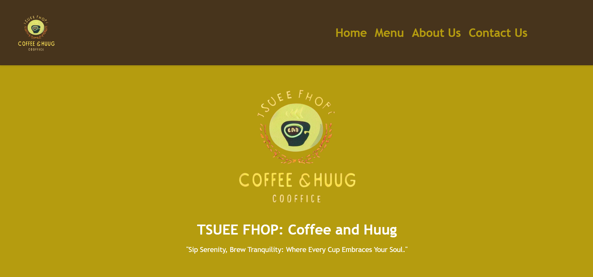
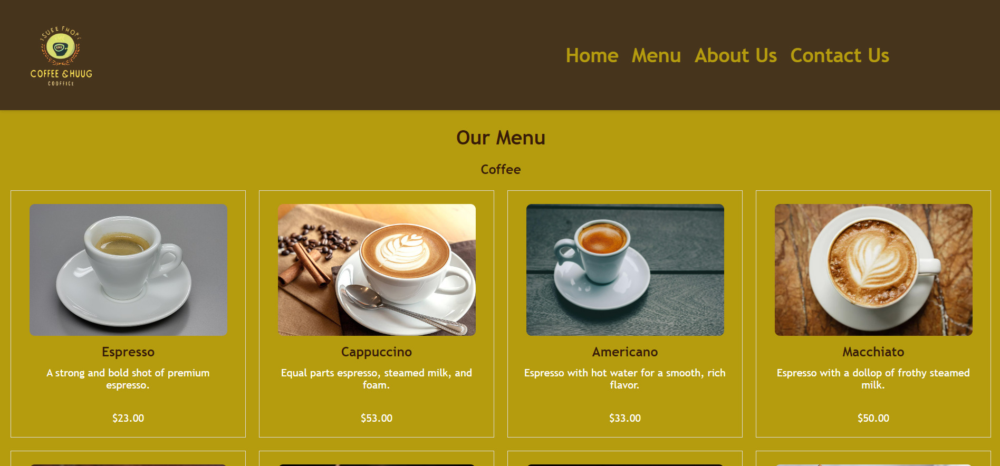
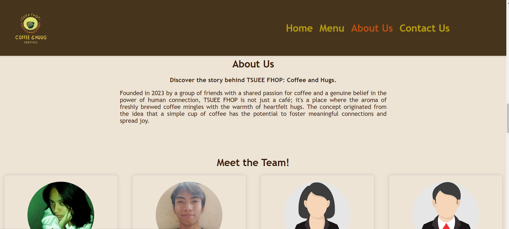
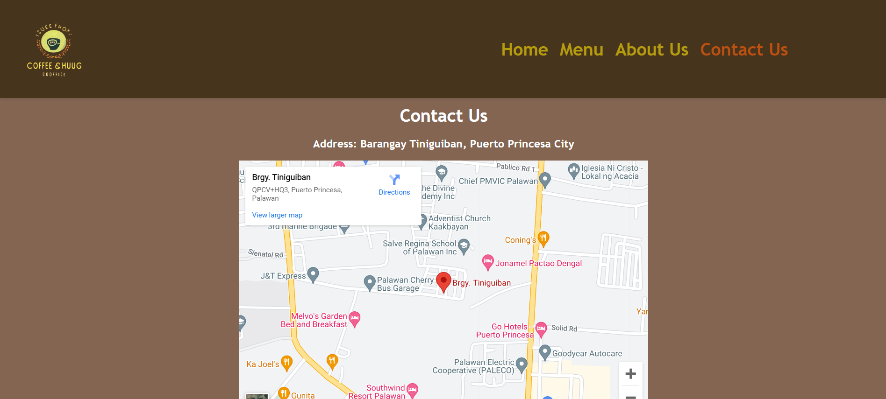

# CozyCup_03-NAVIA-SANGALANG-

# Project Description

 TSUEE FHOP offers a delightful experience with its Coffee and Huug Menu. Indulge in rich, aromatic coffees brewed to perfection, complemented by a selection of heartwarming huugs – a unique blend of comforting hugs and cozy atmospheres. Whether you crave a robust espresso or a comforting embrace, TSUEE FHOP is the perfect blend of warmth and flavor.

# Features

* **Intuitive Navigation:**  TSUEE FHOP's website boasts an intuitive design, ensuring seamless navigation for users to easily explore the Coffee and Huug Menu, specials, and other offerings.

* **Online Ordering System:** Enjoy the convenience of ordering your favorite coffee and huug combinations online. The website features a user-friendly ordering system, allowing customers to customize their beverages and have them ready for pickup or delivery.

* **Virtual Atmosphere Showcase:** The website provides a virtual glimpse into the cozy ambiance of TSUEE FHOP. High-quality images and descriptions offer an immersive experience, allowing visitors to envision the inviting atmosphere of the coffee shop.

* **Interactive Menu:** The website features an interactive menu that not only showcases the diverse coffee options but also highlights the unique huug combinations available. Each item is accompanied by detailed descriptions and captivating visuals.

* **Customer Reviews and Ratings:** TSUEE FHOP's website incorporates a section for customer reviews and ratings. This valuable feedback helps potential customers make informed choices and fosters a sense of community around the coffee and huug experience offered by the shop.

# Screen Captures
### Home Page

***Welcome to TSUEE FHOP's homepage***, where warmth and flavor collide. Immerse yourself in the inviting ambiance through captivating images. Easily navigate our intuitive layout, explore our featured specials, and embrace the convenience of online ordering.

*Your journey into the world of coffee and huugs begins here.*

### Menu

Explore **TSUEE FHOP's** enticing menu section on our website image. From aromatic coffees to heartwarming hugs, each item is beautifully showcased with vivid visuals and detailed descriptions.

*Dive into a world of flavor and comfort at your fingertips*

### About Us

Discover the heart behind **TSUEE FHOP** in our About Us section. Dive into our story, rooted in a passion for crafting exceptional coffee experiences and fostering a community of warmth. Learn about our commitment to quality, sustainability, and the unique blend of flavors and hugs that define our cafe.

*Welcome to the essence of TSUEE FHOP.*

### Contact Us

**Connect with TSUEE FHOP** through our Contact Us section. Whether you have questions, feedback, or just want to say hello, we're here. Find our contact details, including email and phone, and feel free to reach out.

*We value your communication and look forward to hearing from you.*

# About the Authors

 

**NAME:** *Estrella Rose Ann Navia*

**Email:** 202180026@psu.palawan.edu.ph

 

**NAME:** *John Dexter Sangalang*

**Email:** 202180264@psu.palawan.edu.ph